<h2> aws -> lambda -> create function (func name , runtime) -> configuration/generalConfiguration -> edit -> (memory 512 , timeout 5min) -> ..
.. -> back -> permission -> click on link below role -> add permissions </h2>

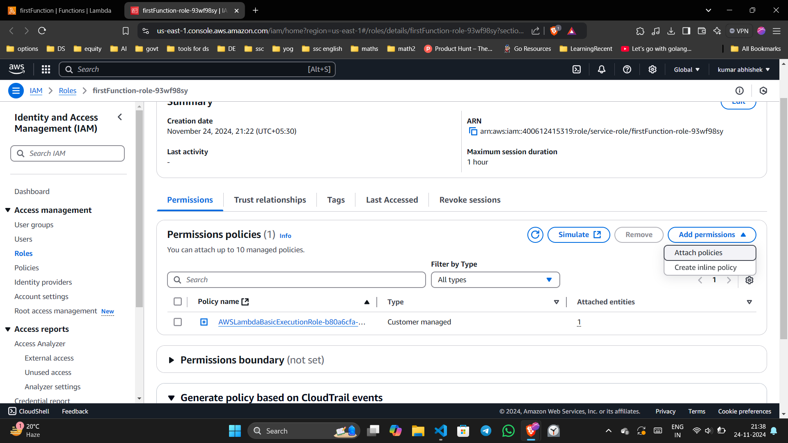

<h1>-> attach policies : amazonRDSfullacess,amazonS3fullAcess</h1>

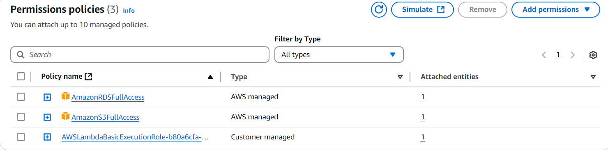

<h3> ->get back to main page</h3>

<h1>add trigger -> </h1>

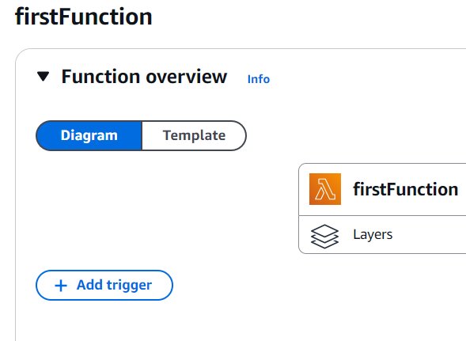

gOo4OsCknn2GropKE4weKDiVVUiN9rr37maJDS1f

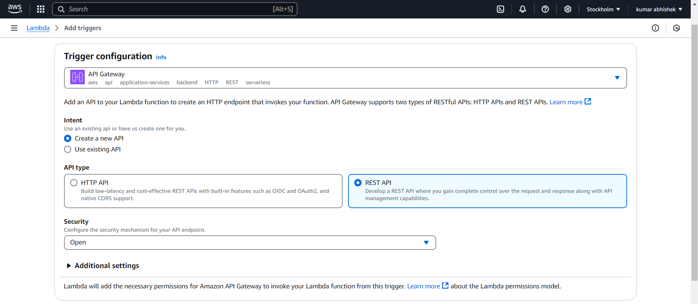

<h1> go set up api key</h1>

<h1>click on link of api gateway</h1>

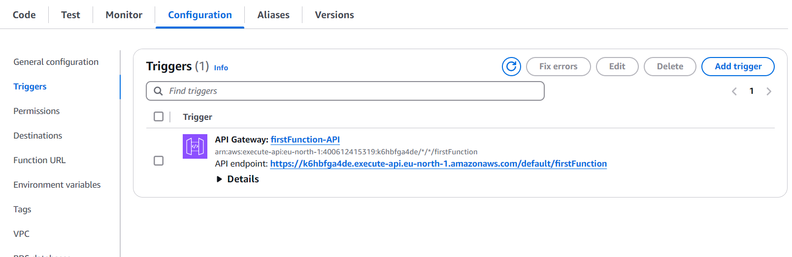

<h1>create method -> </h1>

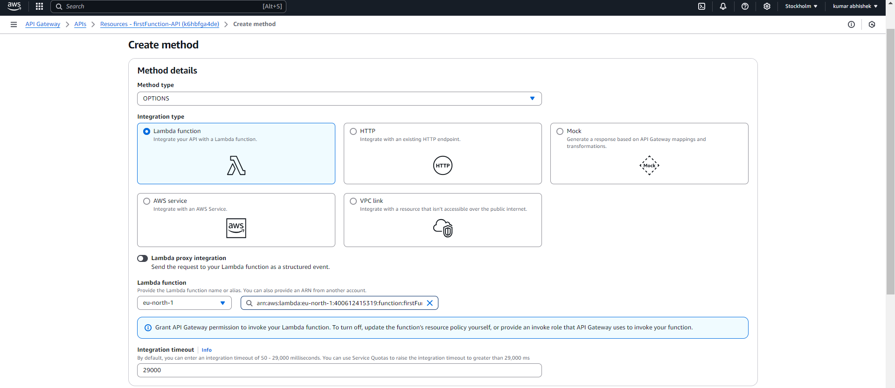

METHOD RESPONSE -> response 200 -> edit

inside header name -> add header one by one

#header
Access-Control-Allow-Headers
Access-Control-Allow-Methods
Access-Control-Allow-Origin

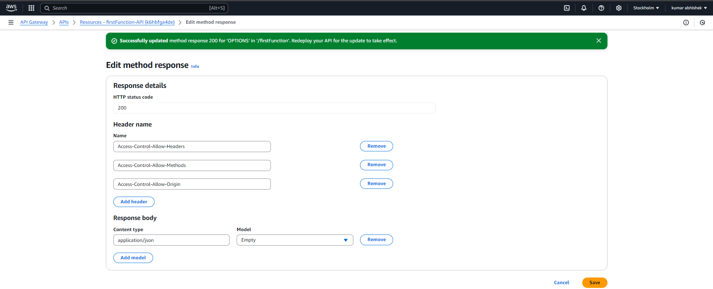
same for create response ( change response code)
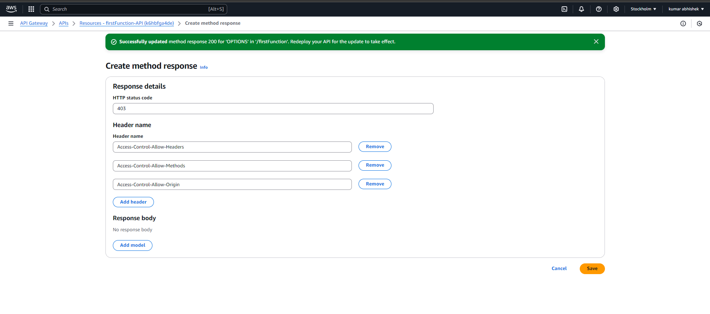

same for response code 500,403

<h1>now edit integration response</h1>

#headers value
Access-Control-Allow-Headers: 'Content-Type,X-Anz-Date,Authorization,X-Api-Key,X-Amz-Security-Token'
Access-Control-Allow-Methods: 'GET,POST,PUT,DELETE,OPTIONS'
Access-Control-Allow-Origin: '*'

#x api key (the key to be added in postman headers when we use the API key)

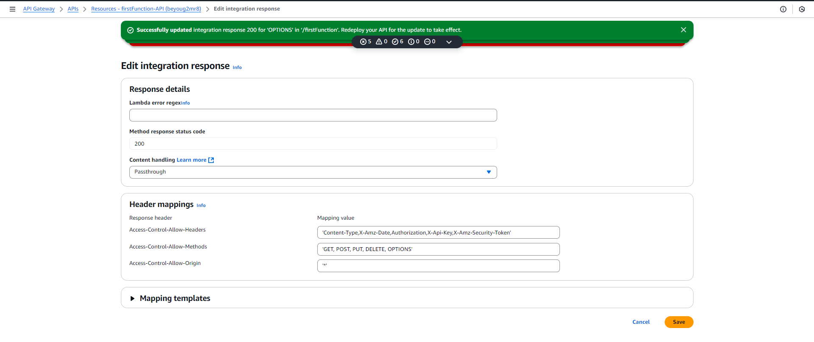

IN ANY: 
for method response , do same steps for 200, 500,403

deploy -> new stage -> name : dev -> desc:developmt

now in left click on usgae plans and select or create usgae plan , add our stage dev and add api key

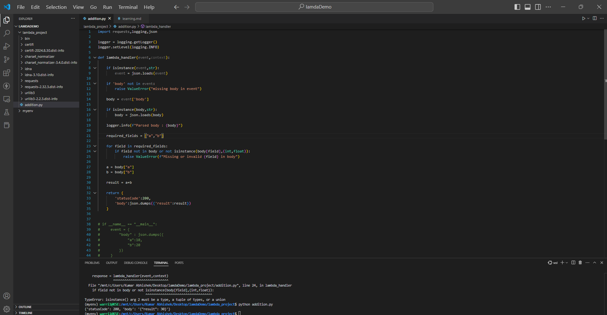

make a zip file of all files and upload it on right side uplpoad option on code 
click layers -> edit beside runtime setting -> set fucntionname.lambda_handler

test -> set anme -> in json area : write as below
{
    "body":{
        "a":10,
        "b":20
    }
}

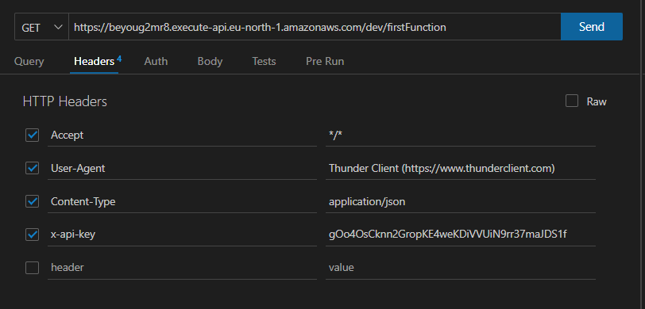

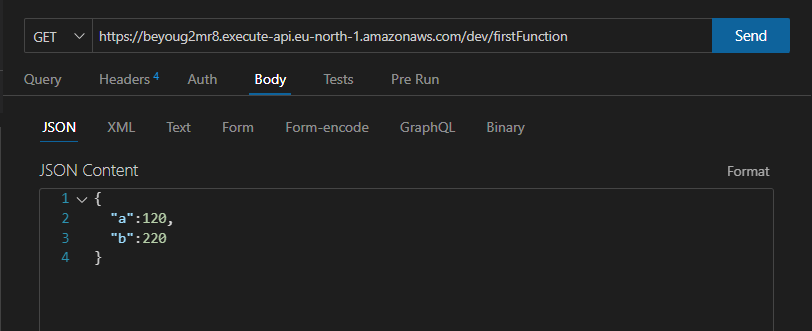