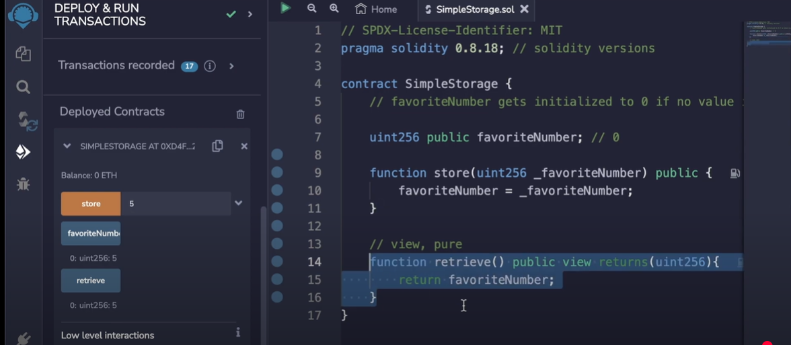
when added public  , then it can be made available on left side to be used otherwise internal

when added as view the function means that its like a returner only i.e not gonna perform any transaction
blue color is reader type and yellow is writer  type

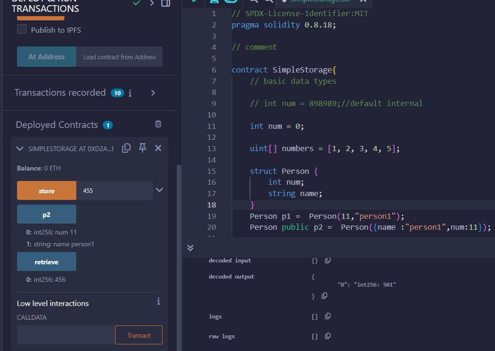

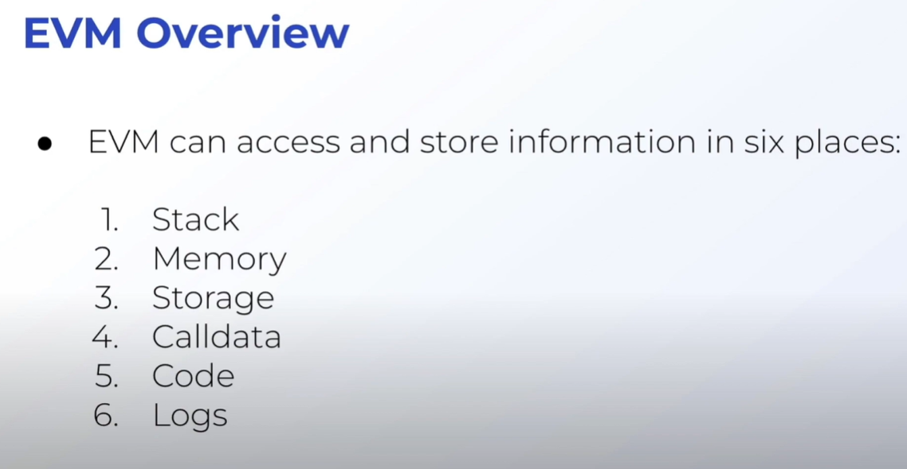
if a fnuction variable is defined as memory , it can be reassigned a value in the current scope , however in callback , it wont

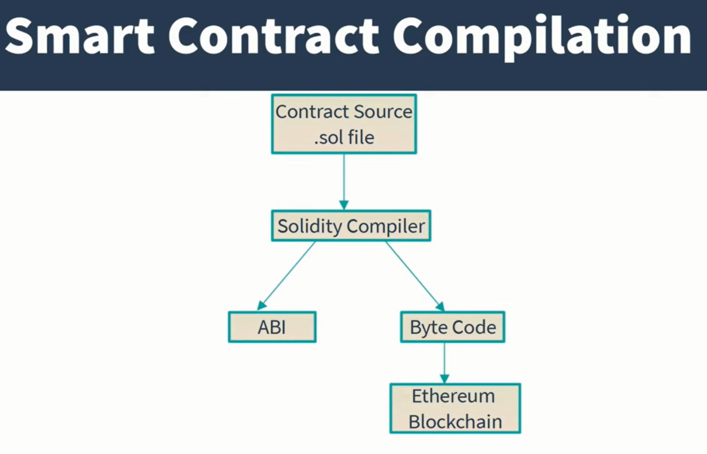
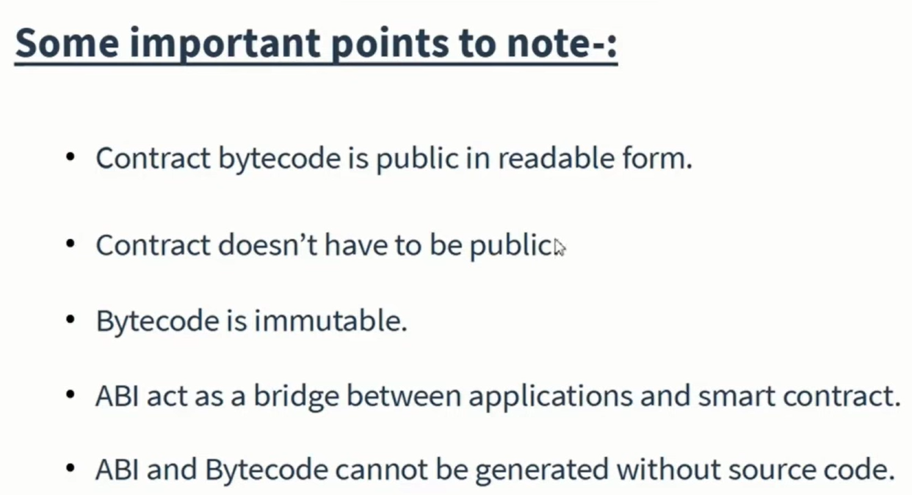

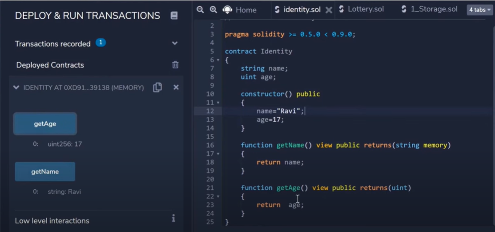
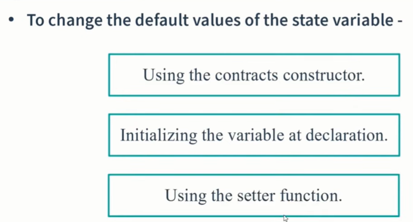
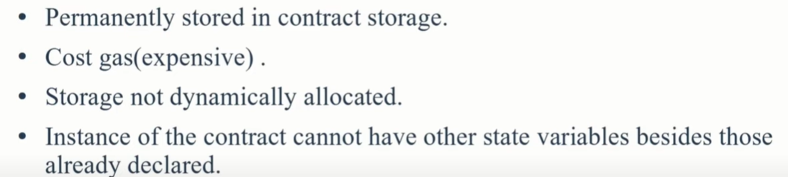
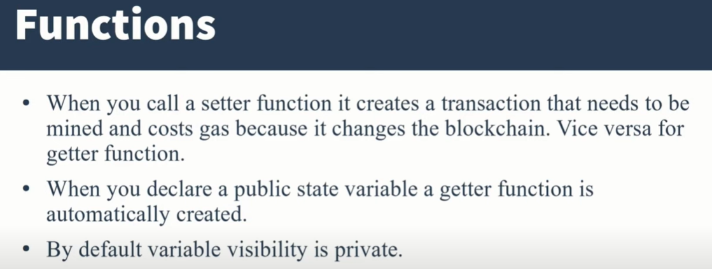
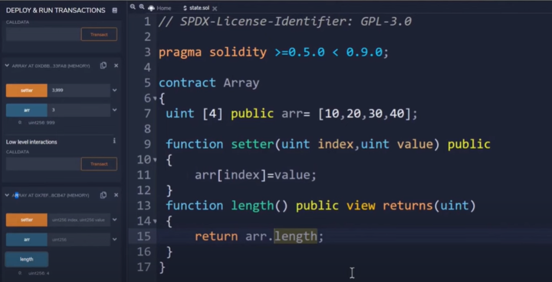
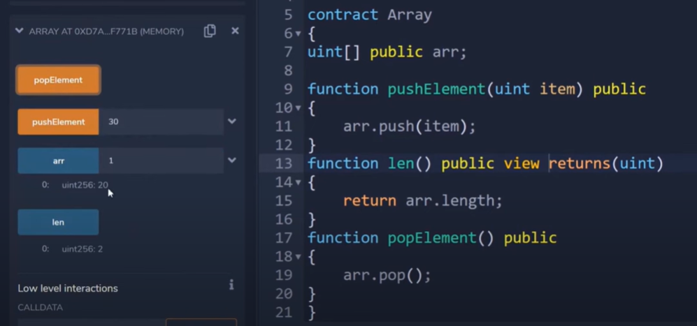
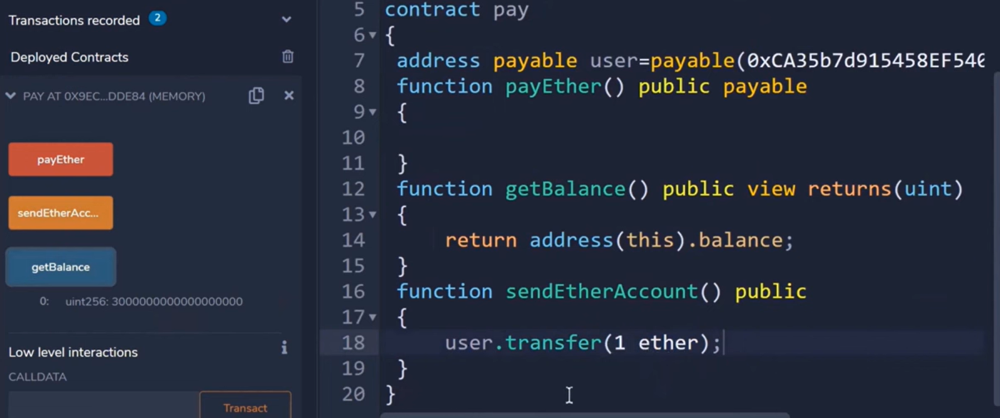

