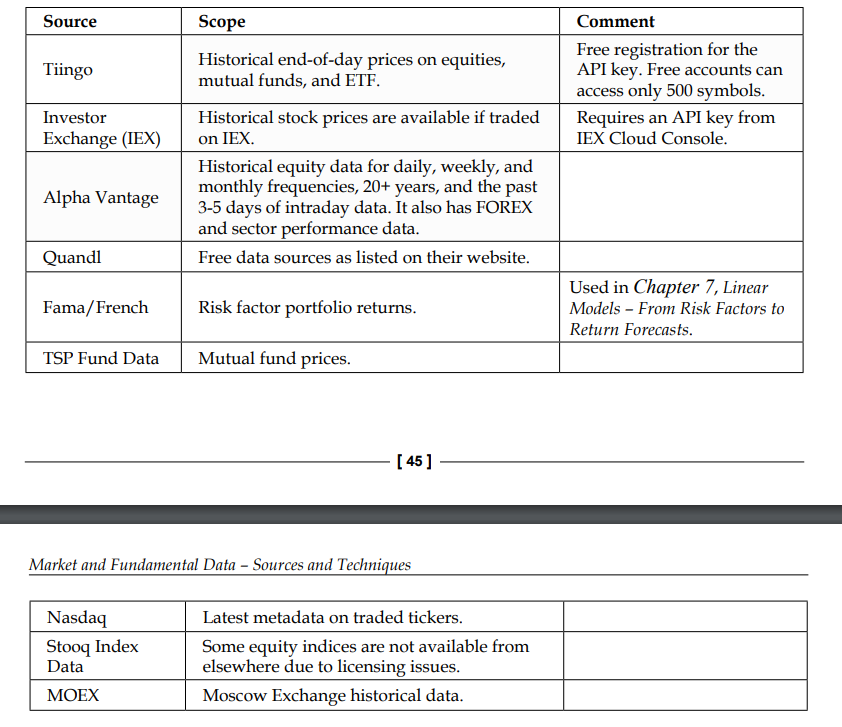
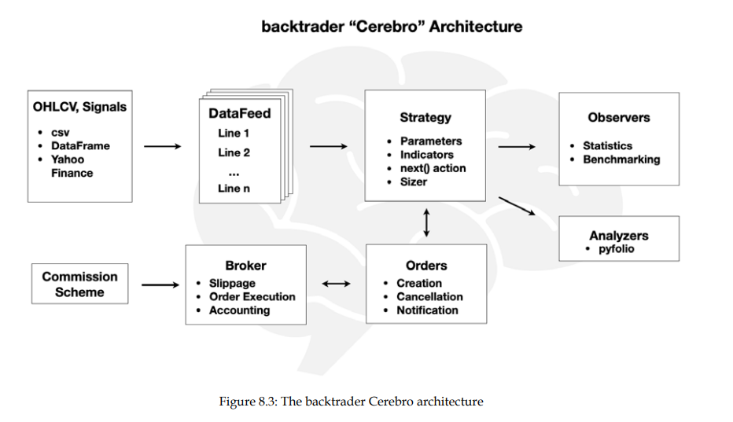

REQUIREMENTS : pandas ewm library

The underlying market is modeled like sinusoidal function

Quantopian platform

Brock et al. (1992)

market inefficiency in which prices takes swings from their fundamental values and (2) markets are efficient and 
the predictable variation can be explained by time-varying equilibrium returns.

Bauer and Dahlquist (2001)

Naved and Srivastava (2015) -> moving average(simple, triangular, exponential, variable, and weighted) , 3 rules (Direction of the moving average, price and moving average crossover and 
crossover of two moving averages with different periods on stocks)
-> profitable ,  simple moving average performed better 

Park and Irwin (2007)

Quantopian 
platform (Algorithm IDE), which is a Python development environment designed to help for 
coding trading strategies using the Algorithm API.

: Its best to use these while using moving average exponential -> span(n-day moving average exponential),centre of mass(C=(S−1)/2) ,
span provides an intuitive way to think about how many observations are significantly weighted in the EWMA. Directly tied to the idea of a "lookback period.
com gives control over the relative weighting of recent vs. past data.Balances the influence of older vs. newer data by specifying where the "center of mass" of the weights lies.
half life Defines the time it takes for the weight of a data point to reduce to half its original value.Intuitive when thinking in terms of "how quickly" the influence of old data decays.
alpha 𝜆  Directly specifies the smoothing constant, controlling the decay rate of older data.

****************************************************************************************************************************************************

BOOK : Machine learning for algorithmic trading (1-294)

few sample data sources that we will source and work with include, but are not limited to:
• Nasdaq ITCH order book data
• Electronic Data Gathering, Analysis, and Retrieval (EDGAR) SEC filings
• Earnings call transcripts from Seeking Alpha
• Quandl daily prices and other data points for over 3,000 US stocks
• International equity data from Stooq and using the yfinance library
• Various macro fundamental and benchmark data from the Federal Reserve
• Large Yelp business reviews and Twitter datasets
• EUROSAT satellite image data

ch1 :   1-19

fundamental law of active management
alternative trading systems (ATS)
electronic communication networks (ECNs)
Dark pools
Direct market access (DMA)
how is high-frequency trading (HFT) profitable
arbitrage trading , Momentum ignition , Order anticipation
HFT by crowdsourcing algorithms
efficient market hypothesis (EMH)

**********************************************************************************

ch2 :   21-58       (Data Aquisition)

eXtensible Business Reporting Language (XBRL)
electronic Financial Information eXchange (FIX) protocol
AlgoSeek

pandas-datareader
https://www.livecoinwatch.com/tools/api
Quantopian
Zipline(-reloaded)
quantRocket
Quandl
yfinance(pylib)
Ta-lib
zerodha/dhan/angelone APIs
https://kernc.github.io/backtesting.py/

**********************************************************************************
ch3 : 59 - 80    (Web Scraping)

web scraping using beautifulsoup is not alone sufficient coz data also gets dynamically loaded
hence we need to get data just like a browser loads it -> hence we use 
Selenium
Scrapy & Splash

**********************************************************************************
ch4 : 81 - 120   (Feature engineering)

alpha factors are transformation of raw data that aim to predict asset price movements
numpy-pandas-zipline-TaLib
kalman filters  ,  wavelets , alphalens , pyfolio

• QuantConnect 
• WorldQuant 
• Alpha Trading Labs  
• The Python Algorithmic Trading Library (PyAlgoTrade)  
• pybacktest 
• ultrafinance 
• Trading with Python 
• Interactive Brokers 

**********************************************************************************
ch5 : 121 - 146  (Portfolio management & Optimization ( risk & return ))

CAPM
Kelly criterion 
https://www.youtube.com/@Quantlab
alpha
beta
Standard Deviation
Sharpe ratio
Information Ratio
https://analystprep.com/study-notes/actuarial-exams/soa/ifm-investment-and-financial-markets/mean-variance-portfolio-theory/
Hierarchical risk parity
hierarchical clustering portfolios 
https://hudsonthames.org/an-introduction-to-the-hierarchical-risk-parity-algorithm/
PyPortfolioOpt

**********************************************************************************
ch6 : 147 - 172 

Unsup Learning for HRP
returns of many individual securities are often driven by a relatively small number of underlying influences, such as market trends, economic factors, or sector performance.
Identifying latent topics in a body of documents
data augumentation using GAN architechture
        1. Frame the problem, identify a target metric, and define success.
        2. Source, clean, and validate the data.
        3. Understand your data and generate informative features.
        4. Pick one or more machine learning algorithms suitable for your data.
        5. Train, test, and tune your models.
        6. Use your model to solve the original problem.
Bhatia and Vandana (2010)
Wager and Athey 2019
heteroskedasticity
advances in financial machine learning (2018) 
How to Figure out CrossValidation when the financial data is sequential
YellowBrick library

**********************************************************************************
ch7 : 173 - 219

Gauss–Markov theorem
fama french factor model
Linear factor model
Multiple TimeSeries CrossValidation
AIC & BIC

**********************************************************************************
ch8 : 221 - 254

vectorized backtesting
BACKTRADER : python library 
Zipline Reloaded

If you are considering algorithmic trading, take a look on the following alternatives:

MesoSim by DeltaRay - Option backtesting service
zipline-live2 - Fork of zipline-live which was updated to zipline v1.2
pylivetrade - Zipline compatible library officially supported by Alpaca brokerage
pipeline-live - Execute Pipeline enabled Zipline algorithms in Alpaca brokerage
backtrader - Python backtesting engine with connections to multiple brokerages
QuantConnect - Open Source based hosted trading platform, supporting multiple brokerages

**********************************************************************************
ch9 : 255 - 294

Statistical Arbitrage
autoregressive conditional heteroskedasticity (ARCH) model
multivariate vector autoregressive models
Tsay (2005) Fabozzi, Focardi, and Kolm (2010)
white noise & iid

pair trading : The goal is to find two assets whose prices have historically moved together, track the spread (the difference between their prices), and, once the spread widens, buy the loser that has dropped below the common trend and short the winner
trend,seasonality, and cycles with unsystematic noise

correlograms

To satisfy the stationarity assumption of many time-series models, we need to transform the original series, often in several steps        :
        logarithm , Deflation , diferencing

unit root -> something that defines non stationarity in time series

ARIMA -> AR(auto correlation(p -> number of previous values its dependendent on)) + Integration + MA(moving average(q -> number of terms for rolling window statistics))
AIC & BIC for reducing model complexity and overfitting by penalizing extra features
ACF & PACF are correlation plots thats helps in determining sudden decrease in lags to determine diferencing

Visual Inspection:
Use ACF and PACF plots:
AR(p): PACF cuts off at lag p.
MA(q): ACF cuts off at lag q.
Information Criteria:
Fit different ARMA models (e.g., ARMA(0,0), ARMA(1,1), ARMA(2,2)) and select the one with the lowest AIC or BIC.
Diagnostic Checking:
Check residuals for white noise behavior and ensure no autocorrelation remains.
Cross-validation:
Use training/test sets to evaluate the forecast accuracy.

p statistics -> autoregression present or not
q

generalized autoregressive conditional heteroskedasticity (GARCH) : time series model used to estimate and forecast the volatility
time series model for prediction and check residuals of model with arch and garch  bith using acf and pacf

Granger causality

ADF test for stationarity test

Cointegration refers to a statistical property of a collection of time series variables that share a common long-term trend despite being non-stationary individually.
there is a linear combination of these series that is stationary, meaning the combination has constant mean and variance over time
Cointegration is very useful: if two or more asset price series tend to revert to a common mean, we can leverage deviations from the trend because they should imply future pricemoves in the opposite direction.

Engle-Granger method is used to identify cointegration relationships between two series. It involves both of the following:
1. Regressing one series on another to estimate the stationary long-term relationship
2. Applying an ADF unit-root test to the regression residual
The null hypothesis is that the residuals have a unit root and are integrated; if we can rejectit, then we assume that the residuals are stationary and, thus, the series are cointegrated

rolling Kalman filter (KF) to remove some noise

Getting entry and exit dates for long and short positions
Finally, we use the set of z-scores to derive trading signals:
1. We enter a long (short) position if the z-score is below (above) two, which implies the spread has moved two rolling standard deviations below (above) the moving average
2. We exit trades when the spread crosses the moving average again

